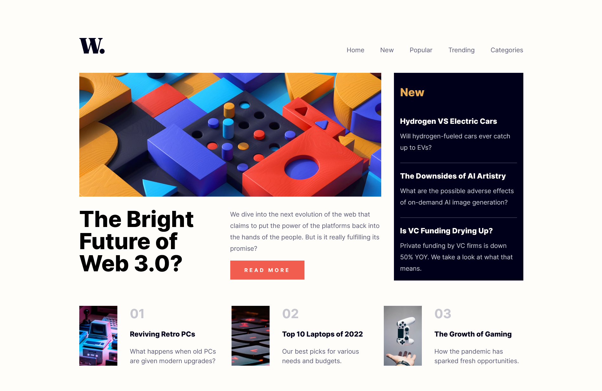

# Frontend Mentor - News homepage solution

This is a solution to the [News homepage challenge on Frontend Mentor](https://www.frontendmentor.io/challenges/news-homepage-H6SWTa1MFl). Frontend Mentor challenges help you improve your coding skills by building realistic projects.

### The challenge

Users should be able to:

-   View the optimal layout for the interface depending on their device's screen size
-   See hover and focus states for all interactive elements on the page
-   **Bonus**: Toggle the mobile menu (requires some JavaScript)

### Screenshot

### Links

-   Live Site URL: [GitHub pages](https://uafederez.github.io/News-Home-Page/)
-   Solution URL: [Frontend Mentor](https://www.frontendmentor.io/solutions/news-homepage-hPP5iM3KGv)

### Built with

-   HTML
-   CSS custom properties
-   Flexbox
-   CSS Grid
-   JavaScript
